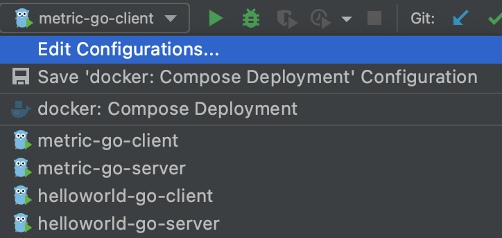

# How To Run

There are three ways to run dubbo-go samples:

1. Quick start with makefile: a common makefile is provided under "build" subdirectory, which can be used to run each sample here quickly. It is also useful to run all samples automatically so that now it is possible to leverage samples as dubbo-go's integration test.
2. Quick start in IDE (**Recommended**): In ".run" subdirectory a couple of GoLand run configuration files are provided so that user can run each sample with just one click.
3. Manually config and run in IDE: For completeness purpose, a step-by-step instruction is also provided so that user can understand how to configure and run or debug a sample in IDE. 

### 1. Quick start with makefile

*Prerequisite: docker environment is required*

Here we use "attachment" as an example:

1. **Start register server (e.g. zookeeper)**
   
   ```bash
   cd attachment/server
   make -f ../../build/Makefile docker-up 
   ```
   
   Once the following messages outputs, the zookeeper server is ready.
   
   ```bash
   >  Starting dependency services with docker/docker-compose.yml
   Creating network "docker_default" with the default driver
   Creating docker_zookeeper_1 ... done
   ```
   
   To shut it down, simple run
   
   ```bash
   cd attachment/server
   make -f ../../build/Makefile docker-down
   ```
   
2. **Start server**
   
    ```bash
    cd attachment/server
    make -f ../../build/Makefile start
    ```
   
   Once the following messages outputs, the server is ready.

   ```bash
   >  Buiding application binary: dist/darwin_amd64/release/go-server
   >  Starting application go-server, output is redirected to dist/darwin_amd64/release/go-server.log
     >  PID: 86428
   ```

   The output of `go-server` can be found from 'dist/darwin_amd64/release/go-server.log'.
   
3. **Run client**
   
    ```bash
   cd attachment/client
   make -f ../../build/Makefile run 
   ```

   Once the following messages outputs, the `go-client` calls the `go-server` successfully.

   ```bash
   >  Buiding application binary: dist/darwin_amd64/release/go-client
   >  Running application go-client, output is redirected to dist/darwin_amd64/release/go-client.log
   ...
   2020-10-27T14:51:37.520+0800    DEBUG   dubbo/dubbo_invoker.go:144      result.Err: <nil>, result.Rest: &{A001 Alex Stocks 18 2020-10-27 14:51:37.52 +0800 CST}
   2020-10-27T14:51:37.520+0800    DEBUG   proxy/proxy.go:177      [makeDubboCallProxy] result: &{A001 Alex Stocks 18 2020-10-27 14:51:37.52 +0800 CST}, err: <nil>
   response result: &{A001 Alex Stocks 18 2020-10-27 14:51:37.52 +0800 CST}
   ```
   
3. **Integration test**
   dubbo-go-samples is designed to serve the purposes of not only the showcases of how to use apache/dubbo-go but also the integration-test for apache/dubbo-go. To run integration test for `go-server`, run the following commands:

   ```bash
   cd attachment/server
   make -f ../../build/Makefile integration
   ```

   Once the following messages outputs, the integration tests pass.

   ```bash
   >  Running integration test for application go-server
   ...
   --- PASS: TestGetUser (0.00s)
   PASS
   ok      github.com/apache/dubbo-go-samples/attachment/go-server/tests/integration   3.603s
   ```
   
4. **Shutdown and cleanup**
   ```bash
   cd attachment/server
   make -f ../../build/Makefile clean docker-down
   ```

*The following two ways are all relevant to IDE. Intellij GoLand is discussed here as an example.*

### 2. Quick start in IDE

Once open this project in GoLand, a list of pre-configured configures for both server and client can be found from "Run Configuration" pop up menu, for example: "helloworld-go-server" and "helloworld-go-client". 



Feel free to pick one among them to run instantly. Of course a service register server is required otherwise the samples cannot run successfully. You may consider to either manually boot up the required register server, or use the provided "docker-compose.yml" to boot it in docker environment, from the following [section](#3-manually-run-in-ide) where you can find more details.

### 3. Manually run in IDE

After open dubbo-go-samples in GoLand, follow the steps below to run/debug this
example:

1. **Start up zookeeper server**

   Open "attachment/go-server/docker/docker-compose.yaml", and click ▶︎▶︎ icon in the gutter on the left side of the
   editor, then "Services" tab should pop up and shows the similar message below:
   ```
   Deploying 'Compose: docker'...
   /usr/local/bin/docker-compose -f .../dubbo-go-samples/attachment/go-server/docker/docker-compose.yml up -d
   Creating network "docker_default" with the default driver
   Creating docker_zookeeper_1 ...
   'Compose: docker' has been deployed successfully.
   ```

2. **Start up service provider**

   Open "attachment/go-server/cmd/server.go", and click ▶︎ icon just besides "main" function in the gutter on the left
   side, and select "Modify Run Configuration..." from the pop-up menu. Then make sure the following configs configured
   correctly:
    * Working Directory: the absolute path to "attachment/go-server", for examples: *
      /home/dubbo-go-samples/attachment/go-server*
    * Environment: CONF_PROVIDER_FILE_PATH=conf/server.yml, optionally you could also specify logging configuration
      with "APP_LOG_CONF_FILE=conf/log.yml"

   Then the sample server is ready to run.

3. **Run service consumer**

   Open "attachment/go-client/cmd/client.go", and click ▶︎ icon just besides "main" function in the gutter on the left
   side, and select "Modify Run Configuration..." from the pop-up menu. Then make sure the following configs configured
   correctly:
    * Working Directory: the absolute path to "attachment/go-client", for examples: *
      /home/dubbo-go-samples/attachment/go-client*
    * Environment: CONF_CONSUMER_FILE_PATH=conf/client.yml, optionally you could also specify logging configuration
      with "APP_LOG_CONF_FILE=conf/log.yml"

   Then run it to call the remote service, you will observe the following message output:
   ```
   [2021-02-03/16:19:30 main.main: client.go: 66] response result: &{A001 Alex Stocks 18 2020-02-04 16:19:30.422 +0800 CST}
   ```

If you need to debug either the samples or dubbo-go, you may consider switch to **Debug** instead of **Run** in GoLand. To stop, simply click ◼︎ to shutdown everything.

