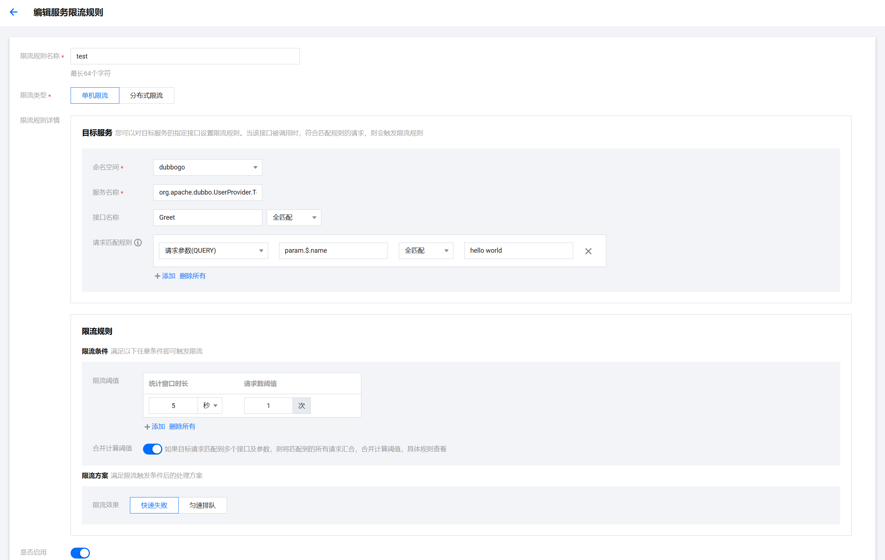

# Dubbo Go & Polaris TpsLimiter Example

[English](README.md) | 中文

## 使用服务限流功能

在 dubbogo 中快速体验北极星的服务限流能力

## 北极星服务端安装

[北极星服务端单机版本安装文档](https://polarismesh.cn/docs/%E4%BD%BF%E7%94%A8%E6%8C%87%E5%8D%97/%E6%9C%8D%E5%8A%A1%E7%AB%AF%E5%AE%89%E8%A3%85/%E5%8D%95%E6%9C%BA%E7%89%88%E5%AE%89%E8%A3%85/)

[北极星服务端集群版本安装文档](https://polarismesh.cn/docs/%E4%BD%BF%E7%94%A8%E6%8C%87%E5%8D%97/%E6%9C%8D%E5%8A%A1%E7%AB%AF%E5%AE%89%E8%A3%85/%E9%9B%86%E7%BE%A4%E7%89%88%E5%AE%89%E8%A3%85/)

## 如何使用

[北极星服务限流使用文档](https://polarismesh.cn/docs/%E5%8C%97%E6%9E%81%E6%98%9F%E6%98%AF%E4%BB%80%E4%B9%88/%E5%8A%9F%E8%83%BD%E7%89%B9%E6%80%A7/%E6%B5%81%E9%87%8F%E7%AE%A1%E7%90%86/#%E8%AE%BF%E9%97%AE%E9%99%90%E6%B5%81)

注意：PolarisMesh 的服务限流能力是工作在 Provider 侧的。

### 如何配置服务限流参数

dubbogo 中的 PolarisMesh TpsLimiter 扩展点实现，能够根据用户配置的限流规则，自动的从当前 RPC 调用上下文以及请求信息中识别出需要参与限流的请求标签信息

请根据以下图片配置限流策略

限流的服务名称为`org.apache.dubbo.UserProvider.Test`



- 请求匹配规则为 **请求参数(QUERY)**
  - 标签来源: RPC 调用中方法的入参，即 Invoaction.Arguments()
  - 标签键规则
    - 方法仅有一个入参: param.$.${fieldName}, **param.** 为固定前缀，后面的表达式为标准的 JSONPath expressions，[参考文档](https://goessner.net/articles/JsonPath/)
    - 方法有多个参数: param[${index}].$.${fieldName}, **param[${index}].** 为固定前缀，${index} 代表是方法入参中的第几个参数，下标起始位置从 0 开始；后面的表达式为标准的 JSONPath expressions，[参考文档](https://goessner.net/articles/JsonPath/)
- 请求匹配规则为 **请求头(HEADER)**: 
  - 标签来源: RPC 调用的额外标签信息，即 Invoaction.Attachments()

### 运行服务提供者

进入 go-server 的 cmd 目录，执行以下命令

```
cd filter/polaris/limit/go-server/cmd
go run .
```

当看到以下日志时即表示 server 端启动成功

```log
INFO	triple/triple.go:68	[TRIPLE Protocol] Export service:
```


### 运行服务调用者

进入 go-client 的 cmd 目录，执行以下命令

```
cd filter/polaris/limit/go-client/cmd
go run .
```

当看到以下日志时即表示 go-client 成功发现 go-server 并发起了 RPC 调用

```log
INFO	cmd/main.go:56	greeting:"hello world"
```

当看到以下日志时即表示在 PolarisMesh 针对 go-server 配置的限流策略已生效

```log
ERROR	handler/rejected_execution_handler_only_log.go:74	The invocation was rejected.
```
