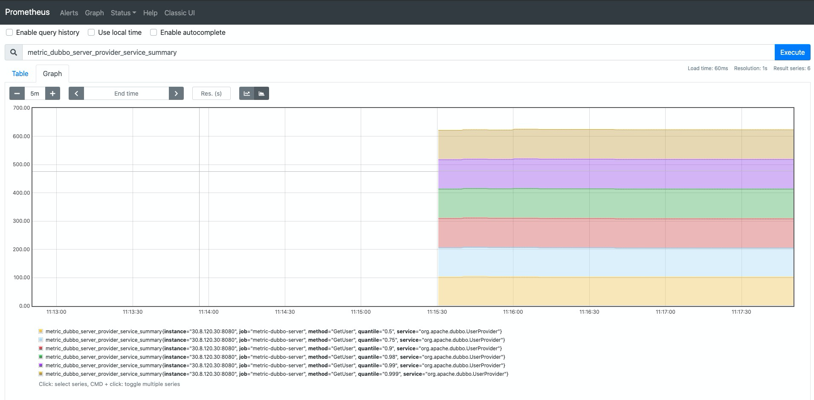

# metric 示例

### Backend

[dubbo metric](https://github.com/alibaba/metrics) s a library of standard metrics that we can easily list the various metrics we care about in the RPC space, such as the number of calls per service, response time; And if you want to be a little bit more detailed, there's also the distribution of various response times, the average response time.If you're interested in the principle, you can go and see [eBay 邓明：dubbo-go 中 metrics 的设计](https://dubbo.apache.org/zh/blog/2021/01/11/dubbo-go-中-metrics-的设计) .Now I'm going to use [prometheus](https://prometheus.io/docs/introduction/overview) to show metric

###  Show turns



### Matters needing attention

* [prometheus](https://prometheus.io/docs/introduction/overview) Need a legitimate name，Details pls see [dubbo-go](https://github.com/apache/dubbo-go/blob/master/metrics/prometheus/reporter.go)

* Modify the local real ip [prometheus.yml](./go-server/docker/config/prometheus.yml)

> prometheus.yml config
```yaml
# my global config
global:
  scrape_interval: 120s
  evaluation_interval: 120s
  external_labels:
    monitor: 'metric-dubbo-go-server'
scrape_configs:
  - job_name: 'prometheus'
    scrape_interval: 120s
    static_configs:
      - targets: [ 'localhost:9090' ]

  - job_name: 'metric-dubbo-server'
    scheme: http
    scrape_interval: 10s
    static_configs:
      # local ip
      - targets: [ 'local ip:8080' ]
```

Pls. refer to [HOWTO.md](../HOWTO.md) under the root directory to run this sample.
