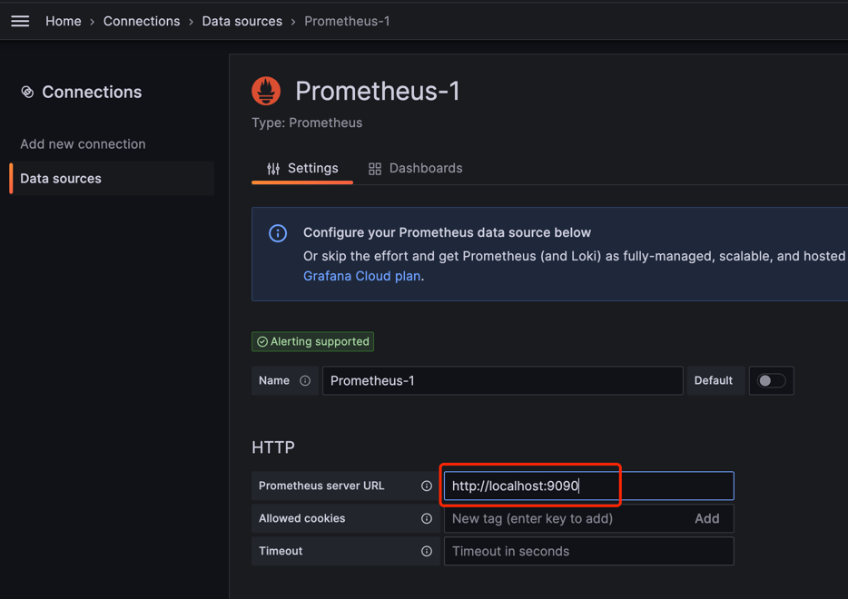
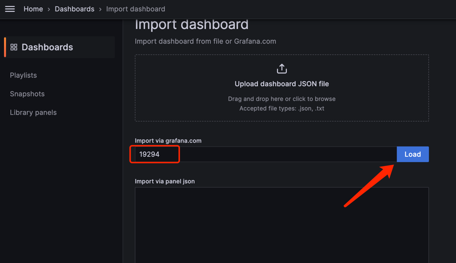
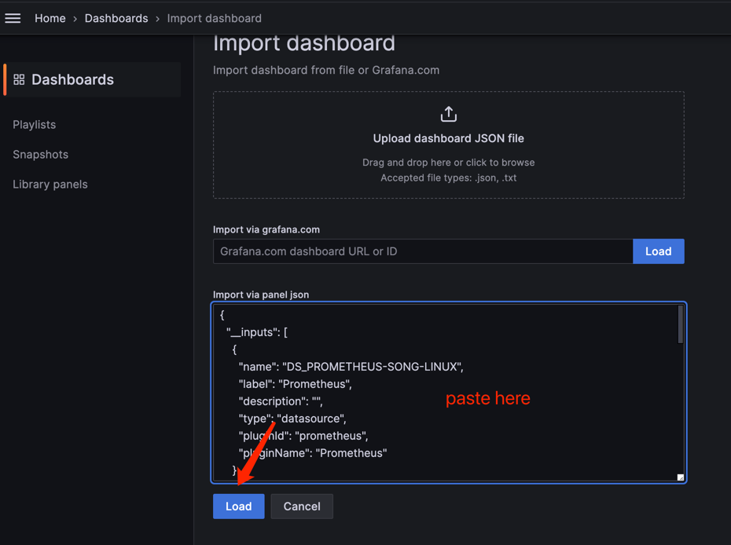
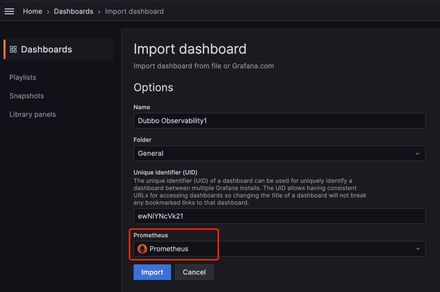
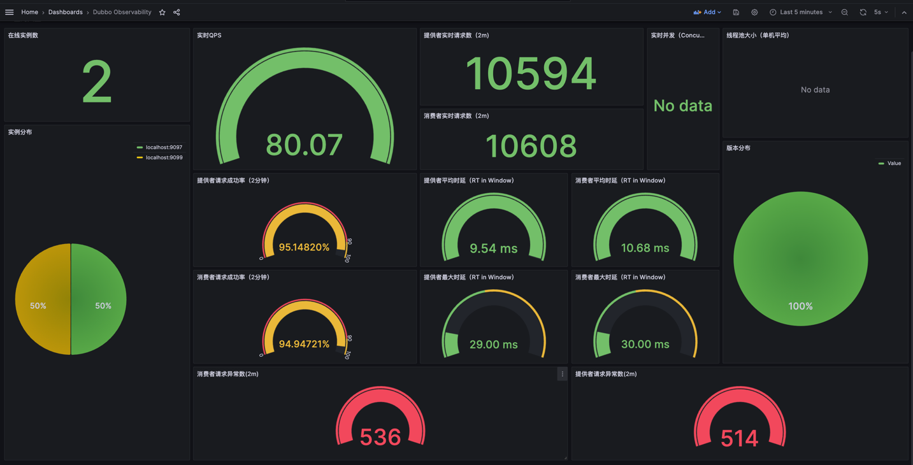

# metrics for dubbo-go

This example demonstrates the metrics usage of dubbo-go as an RPC framework. Check [Quick Start][] on our official website for detailed explanation.

## Contents

- server/main.go - is the main definition of the service, handler and rpc server
- client/main.go - is the rpc client
- proto - contains the protobuf definition of the API

## How to run

### Run server
```shell
go run ./go-server/cmd/main.go
```

test server work as expected:
```shell
curl \
    --header "Content-Type: application/json" \
    --data '{"name": "Dubbo"}' \
    http://localhost:20000/greet.GreetService/Greet
```

### Run client
```shell
go run ./go-client/cmd/main.go
```

install prometheus and open prometheus config file `prometheus.yml`, write the config like this

```yaml
global:
  evaluation_interval: 15s
  scrape_interval: 15s
scrape_configs:
- job_name: dubbo-provider
  scrape_interval: 15s
  scrape_timeout: 5s
  metrics_path: /prometheus
  static_configs:
    - targets: ['localhost:9099']
- job_name: dubbo-consumer
  scrape_interval: 15s
  scrape_timeout: 5s
  metrics_path: /prometheus
  static_configs:
    - targets: ['localhost:9097']
```

install grafana and open grafana web page like `localhost:3000`

open: 【Home / Connections / Data sources】

click 【Add new data source】

select Prometheus

enter 【Prometheus server URL】 like `http://localhost:9090` and click 【Save & test】



open 【Home / Dashboards 】click 【New】【import】and enter 19294 click Load



if you can't access internet you can open `https://grafana.com/grafana/dashboards/19294-dubbo-observability/` and click 【Download JSON】

paste the JSON





click 【Import】button and you will see the Dubbo Observability dashboard,enjoy it

