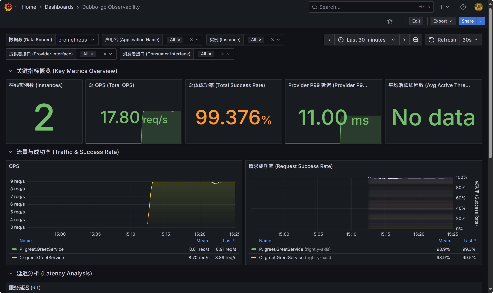

# Dubbo-Go 指标监控示例

[English](README.md) | 中文

本示例演示了如何使用 **Prometheus Pushgateway** 的Push和Pull模式来监控 Dubbo-Go 应用程序，并通过 Grafana 进行可视化展示。


---

## 核心架构

监控数据流如下：

**Push 模式：应用 (go-client / go-server) -> Prometheus Pushgateway -> Prometheus -> Grafana**

**Pull 模式：应用 (go-client / go-server) -> Prometheus -> Grafana**


## 包含组件

| 组件              | 端口     | 描述                                     |
|:----------------|:-------|:---------------------------------------|
| **Grafana**     | `3000` | 用于指标可视化的仪表盘。                           |
| **Prometheus**  | `9090` | 负责存储和查询指标数据，它会从 Pushgateway 拉取数据。      |
| **Pushgateway** | `9091` | 用于接收来自 Dubbo-Go 应用推送的指标数据。             |
| **go-server**   | N/A    | Dubbo-Go 服务提供者 (Provider) 示例。          |
| **go-client**   | N/A    | Dubbo-Go 服务消费者 (Consumer) 示例，会持续调用服务端。 |

## 配置说明

### 环境变量

客户端和服务端使用相同的配置方式：
```bash
# Pushgateway 地址 (必需)
export PUSHGATEWAY_URL="127.0.0.1:9091"

# 任务名称标识 (必需)
export JOB_NAME="dubbo-service"

# Pushgateway 认证用户名 (可选)
export PUSHGATEWAY_USER="username"

# Pushgateway 认证密码 (可选)
export PUSHGATEWAY_PASS="1234"

# ZooKeeper 地址 (必需)
export ZK_ADDRESS="127.0.0.1:2181"
```

### 命令行参数


```bash
# 使用 Push 模式（默认）
go run ./go-client/cmd/main.go
go run ./go-server/cmd/main.go


# 使用 Pull 模式（不推送指标到 Pushgateway）
go run ./go-client/cmd/main.go --push=false
go run ./go-server/cmd/main.go --push=false
```

## 🚀 快速开始

请按照以下步骤来运行此示例。

### 前提条件：

- 请根据实际的网络情况配置 `prometheus_pull.yml`、`prometheus_push.yml`、`go-client/cmd/main.go`、`go-server/cmd/main.go`
  中的网络地址。
- 如果您想体验Push模式，请将 `docker-compose.yml` 第 38 行的 `- ./prometheus_pull.yml:/etc/prometheus/prometheus.yml` 改为
  `- ./prometheus_push.yml:/etc/prometheus/prometheus.yml`，然后重新启动服务。

### 步骤 1: 启动监控服务栈

首先，启动 Grafana, Prometheus 和 Pushgateway 服务。我们使用 `docker-compose` 来一键完成。

```bash
# 进入 metrics 目录
cd metrics
# 以后台模式启动所有监控服务
docker-compose up -d
```

您现在可以通过以下地址访问各个服务的 Web UI：

- **Grafana**: `http://localhost:3000`
- **Prometheus**: `http://localhost:9090`
- **Pushgateway**: `http://localhost:9091`

### 步骤 2: 启动 Dubbo-Go 服务端

在metrics目录，新开一个终端窗口，运行服务端程序。

```bash
go run ./go-server/cmd/main.go
```

您会看到服务端成功启动并注册服务的日志。

### 步骤 3: 启动 Dubbo-Go 客户端

在metrics目录，再次新开一个终端窗口，运行客户端程序。客户端会循环调用服务端的方法，并且会随机失败，从而产生监控指标。

```bash
go run ./go-client/cmd/main.go
```

客户端将开始输出调用结果，同时将监控指标推送到 Pushgateway。您可以在 Pushgateway 的 UI (`http://localhost:9091/metrics`)
上看到推送上来的指标。

### 步骤 4: 配置 Grafana 并导入大盘

现在，所有服务都已运行，我们来配置 Grafana 以展示数据。

#### 4.1. 添加 Prometheus 数据源

1. 打开 Grafana 网站：[`http://localhost:3000`](http://localhost:3000) (默认用户名/密码: `admin`/`admin`)。
2. 在左侧菜单中，导航至 **Home -> Connections -> Data sources**。
3. 点击 **【Add new data source】** 按钮。
4. 选择 **Prometheus**。
5. 在 **Prometheus server URL** 字段中，输入 `http://host.docker.internal:9090`。
   > **Note**: `host.docker.internal` 是一个特殊的 DNS 名称，它允许 Docker 容器（如 Grafana）访问宿主机的网络，您可以根据实际情况进行配置。
6. 点击底部的 **【Save & test】** 按钮，您应该会看到 "Data source is working" 的成功提示。

#### 4.2. 导入 Dubbo 监控大盘

1. 在左侧菜单中，导航至 **Home -> Dashboards**。
2. 点击右上角的 **【New】** -> **【Import】**。
3. 将 `grafana.json` 的内容复制到 **Import via panel json** 文本框中，或者点击 **Upload JSON file** 按钮上传 `grafana.json` 文件。
4. 在下一个页面中，确保为大盘选择我们刚刚创建的 Prometheus 数据源。
5. 点击 **【Import】** 按钮。

### 步骤 5: 查看监控大盘

导入成功后，您将看到一个完整的 Dubbo 可观测性大盘！面板中的数据（如QPS、成功率、延迟等）会随着客户端的持续调用而动态更新。



尽情使用吧！

## Pushgateway 的僵尸指标
### 问题描述
Pushgateway 设计初衷：为短生命周期进程（batch job、cron job）提供一个临时的指标中转点，方便 Prometheus 抓取。

但默认行为：Pushgateway 不会自动删除已上报但不再更新的指标。
也就是说，任务上报一次后即使停止，上报的那组标签（job/instance）对应的指标会一直存在。

### 方案一：应用侧自动清理（已实现）

**实现原理**：

-   应用启动时注册`job_pushed_at_seconds`时间戳指标
-   应用运行时定期更新时间戳
-   应用优雅退出时自动调用 Pushgateway DELETE API 清理自身指标

### 方案二：运维侧生产级清理器（pgw-cleaner）
详细请看:  [tools/pgw-cleaner](../tools/pgw-cleaner/README.md)


## 常见问题 (Troubleshooting)

- **Grafana 大盘显示 "No Data"**
    - 请确认 Prometheus 数据源的 URL (`http://host.docker.internal:9090`) 是否正确且测试连接成功。
    - 访问 Prometheus UI (`http://localhost:9090`)，在 `Status -> Targets` 页面检查 `pushgateway` 任务是否为 **UP** 状态。
    - 在 Prometheus 的查询栏中输入 `dubbo_consumer_requests_succeed_total`，确认能查询到数据。

- **`host.docker.internal` 无法连接**
    - `host.docker.internal` 是 Docker 的内置功能，如果该地址无法访问，请将 `metrics/prometheus.yml`
      中的Ip地址以及Grafana的数据源地址换为实际的Ip地址。

-----

## 部署到 Kubernetes

#### kube-prometheus

在 Kubernetes (k8s) 中安装 prometheus，请参考 [kube-prometheus](https://github.com/prometheus-operator/kube-prometheus) 项目。

将 `prometheus-service.yaml` 的服务类型（type）设置为 `NodePort`。

1.  将 `dubboPodMoitor.yaml` 文件添加到 `kube-prometheus` 的 `manifests` 目录下，内容如下：

    ```yaml
    apiVersion: monitoring.coreos.com/v1
    kind: PodMonitor
    metadata:
      name: podmonitor
      labels:
        app: podmonitor
      namespace: monitoring
    spec:
      namespaceSelector:
        matchNames:
          - dubbo-system
      selector:
        matchLabels:
          app-type: dubbo
      podMetricsEndpoints:
        - port: metrics # 引用 dubbo-app 的端口名称 metrics
          path: /prometheus
    ---
    # 权限控制 (RBAC)
    apiVersion: rbac.authorization.k8s.io/v1
    kind: Role
    metadata:
      namespace: dubbo-system
      name: pod-reader
    rules:
      - apiGroups: [ "" ]
        resources: [ "pods" ]
        verbs: [ "get", "list", "watch" ]

    ---
    # 权限控制 (RBAC)
    apiVersion: rbac.authorization.k8s.io/v1
    kind: RoleBinding
    metadata:
      name: pod-reader-binding
      namespace: dubbo-system
    roleRef:
      apiGroup: rbac.authorization.k8s.io
      kind: Role
      name: pod-reader
    subjects:
      - kind: ServiceAccount
        name: prometheus-k8s
        namespace: monitoring
    ```

2.  执行 `kubectl apply -f Deployment.yaml`

3.  打开 Prometheus 的网页界面，例如 `http://localhost:9090/targets`