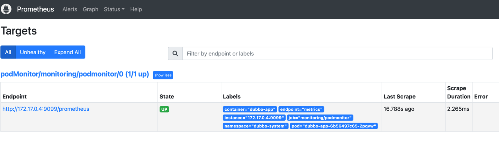

# dubbo-go 的度量指标

这个示例演示了如何在 RPC 框架 dubbo-go 使用度量指标。更详细的说明请参考我们官网的[快速开始](https://cn.dubbo.apache.org/zh-cn/overview/mannual/golang-sdk/quickstart/)

## 目录

- server/main.go - 定义了服务，处理程序和 RPC 服务器的主程序。
- client/main.go - 是 RPC 客户端。
- proto - 包含了 API 的 protobuf 定义。

## 如何运行

### 运行服务端
```shell
go run ./go-server/cmd/main.go
```

测试一下服务端是否按照预期工作：
```shell
curl \
    --header "Content-Type: application/json" \
    --data '{"name": "Dubbo"}' \
    http://localhost:20000/greet.GreetService/Greet
```

### 运行客户端
```shell
go run ./go-client/cmd/main.go
```

## 部署到本地
安装 prometheus 并打开 prometheus 配置文件 `prometheus.yml`，配置如下：

```yaml
global:
  evaluation_interval: 15s
  scrape_interval: 15s
scrape_configs:
- job_name: dubbo-provider
  scrape_interval: 15s
  scrape_timeout: 5s
  metrics_path: /prometheus
  static_configs:
    - targets: ['localhost:9099']
- job_name: dubbo-consumer
  scrape_interval: 15s
  scrape_timeout: 5s
  metrics_path: /prometheus
  static_configs:
    - targets: ['localhost:9097']
```

安装 grafana 并打开 grafana 的 web 页面，如 `localhost:3000`

打开【Home / Connections / Data sources】

点击【Add new data source】

选择 Prometheus

输入【Prometheus server URL】（比如 `http://localhost:9090`）然后点击【Save & test】


打开【Home / Dashboards】然后点击【New】【import】并输入 19294 点击加载


如果你的 Grafana 无法访问互联网，可以访问 `https://grafana.com/grafana/dashboards/19294-dubbo-observability/` 并点击 【Download JSON】

粘贴 JSON


点击【Import】按钮你将看到 Dubbo 可观察性仪表盘，尽情享受吧！


## 部署到 Kubernetes

#### kube-prometheus

在 K8s 中安装 prometheus [kube-prometheus](https://github.com/prometheus-operator/kube-prometheus)

将 `prometheus-service.yaml` 中的类型设置为 NodePort

1. 将 `dubboPodMoitor.yaml` 添加到 `kube-prometheus` 的 `manifests` 目录下，内容如下：
 ```yaml
apiVersion: monitoring.coreos.com/v1
kind: PodMonitor
metadata:
  name: podmonitor
  labels:
    app: podmonitor
  namespace: monitoring
spec:
  namespaceSelector:
    matchNames:
      - dubbo-system
  selector:
    matchLabels:
      app-type: dubbo
  podMetricsEndpoints:
    - port: metrics # 引用 dubbo-app 用于暴露指标的端口名
      path: /prometheus
---
# rbac
apiVersion: rbac.authorization.k8s.io/v1
kind: Role
metadata:
  namespace: dubbo-system
  name: pod-reader
rules:
  - apiGroups: [""]
    resources: ["pods"]
    verbs: ["get", "list", "watch"]

---
# rbac
apiVersion: rbac.authorization.k8s.io/v1
kind: RoleBinding
metadata:
  name: pod-reader-binding
  namespace: dubbo-system
roleRef:
  apiGroup: rbac.authorization.k8s.io
  kind: Role
  name: pod-reader
subjects:
  - kind: ServiceAccount
    name: prometheus-k8s
    namespace: monitoring
```

2. `kubectl apply -f Deployment.yaml`

3. 打开 Prometheus 网页，如 http://localhost:9090/targets
   

