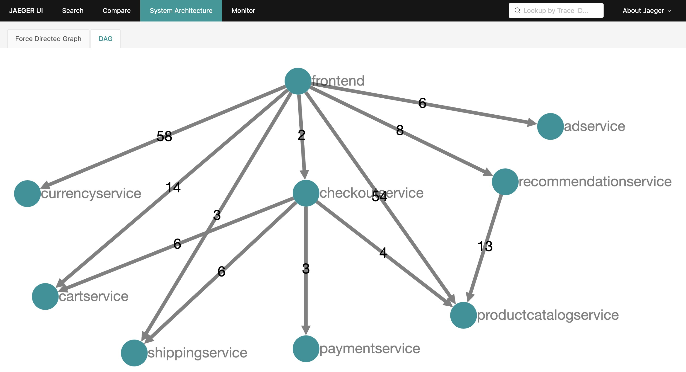

# Dubbo Go Demo [](https://opensource.org/licenses/Apache-2.0) [](https://godoc.org/github.com/go-micro/demo) [](https://github.com/go-micro/demo/actions/workflows/ci.yml) [](https://github.com/go-micro/demo/actions/workflows/docker.yml)

<p align="center">

</p>

**This application was forked from [microservices-demo](https://github.com/GoogleCloudPlatform/microservices-demo), used to demonstrate how to build micro servics with [dubbo-go](https://github.com/apache/dubbo-go).**

**Online Boutique** is a cloud-native microservices demo application.
Online Boutique consists of a 11-tier microservices application. The application is a
web-based e-commerce app where users can browse items,
add them to the cart, and purchase them.

## 🚀 Quick Start

### Prerequisites

Before you begin, make sure you have the following installed:

- [Go](https://golang.org/doc/install) 
- [Python 3](https://www.python.org/downloads/)
- [pip3](https://pip.pypa.io/en/stable/installation/)
- [ZooKeeper](https://zookeeper.apache.org/)

### One-Command Setup

Start all services with a single command:

```bash
make start-all
```

This command will:
1. Build all 11 microservices
2. Start business services in the background
3. Wait for services to initialize
4. Start the load generator

### Access the Application

Once all services are running, you can access:
- **Web Frontend**: http://localhost:8090
- **Service Status**: Check with `make status`
- **Service Logs**: View with `make logs`

## 📋 Makefile Commands

The project includes a comprehensive Makefile for easy service management:

### Basic Commands

| Command | Description |
|---------|-------------|
| `make help` | Show all available commands |
| `make start-all` | Build and start all services |
| `make stop-all` | Stop all running services |
| `make status` | Check status of all services |
| `make logs` | View logs from all services |

### Service Management

| Command | Description |
|---------|-------------|
| `make build-all` | Build all services without starting |
| `make clean-all` | Clean all build artifacts |
| `make tidy-all` | Run `go mod tidy` for all services |

### Individual Service Control

You can control individual services using the pattern `make <action>-<service>`:

```bash
# Build specific service
make build-adservice
make build-cartservice

# Start specific service
make start-adservice
make start-cartservice

# Stop specific service
make stop-adservice
make stop-cartservice
```

### Available Services

- `adservice` - Advertisement service
- `cartservice` - Shopping cart service
- `checkoutservice` - Checkout processing service
- `currencyservice` - Currency conversion service
- `emailservice` - Email notification service
- `frontendservice` - Web frontend service
- `paymentservice` - Payment processing service
- `productcatalogservice` - Product catalog service
- `recommendationservice` - Product recommendation service
- `shippingservice` - Shipping cost calculation service
- `loadgenerator` - Load testing service

### Environment Setup

Initialize your development environment:

```bash
# Check prerequisites and initialize project
make init

# Check environment dependencies
make check-env
```

### Service Monitoring

Monitor your services:

```bash
# Check which services are running
make status

# View recent logs from all services
make logs

# View logs for a specific service
tail -f logs/frontend.log
```

### Troubleshooting

If you encounter issues:

1. **Check service status**: `make status`
2. **View logs**: `make logs`
3. **Restart services**: `make stop-all && make start-all`
4. **Clean build**: `make clean-all && make build-all`

### Development Workflow

For development, you might want to:

```bash
# Start only business services for development
make start-all

# Stop all services when done
make stop-all
```

## Screenshots

| Home Page                                                                                                               | Checkout Screen                                                                                                          |
| ----------------------------------------------------------------------------------------------------------------------- | ------------------------------------------------------------------------------------------------------------------------ |
| [](./docs/img/online-boutique-frontend-1.png) | [](./docs/img/online-boutique-frontend-2.png) |


## Architecture

**Online Boutique** is composed of 11 microservices written in different
languages that talk to each other over gRPC. See the [Development Principles](/docs/development-principles.md) doc for more information.

[](./docs/img/architecture-diagram.png)

| Service                                              | Language      | Description                                                                                                                       |
|------------------------------------------------------| ------------- | --------------------------------------------------------------------------------------------------------------------------------- |
| [frontendservice](src/frontendservice)               | Go            | Exposes an HTTP server to serve the website. Does not require signup/login and generates session IDs for all users automatically. |
| [cartservice](./src/cartservice)                     | Go            | Stores the items in the user's shopping cart in Redis and retrieves it.                                                           |
| [productcatalogservice](./src/productcatalogservice) | Go            | Provides the list of products from a JSON file and ability to search products and get individual products.                        |
| [currencyservice](./src/currencyservice)             | Go            | Converts one money amount to another currency. Uses real values fetched from European Central Bank. It's the highest QPS service. |
| [paymentservice](./src/paymentservice)               | Go            | Charges the given credit card info (mock) with the given amount and returns a transaction ID.                                     |
| [shippingservice](./src/shippingservice)             | Go            | Gives shipping cost estimates based on the shopping cart. Ships items to the given address (mock)                                 |
| [emailservice](./src/emailservice)                   | Go            | Sends users an order confirmation email (mock).                                                                                   |
| [checkoutservice](./src/checkoutservice)             | Go            | Retrieves user cart, prepares order and orchestrates the payment, shipping and the email notification.                            |
| [recommendationservice](./src/recommendationservice) | Go            | Recommends other products based on what's given in the cart.                                                                      |
| [adservice](./src/adservice)                         | Go            | Provides text ads based on given context words.                                                                                   |
| [loadgenerator](./src/loadgenerator)                 | Python+Locust | Continuously sends requests imitating realistic user shopping flows to the frontend.                                              |

## Features

- **[Kubernetes](https://kubernetes.io)/[GKE](https://cloud.google.com/kubernetes-engine/):**
  The app is designed to run on Kubernetes (both locally on "Docker for
  Desktop", as well as on the cloud with GKE).
- **[gRPC](https://grpc.io):** Microservices use a high volume of gRPC calls to
  communicate to each other.
- **[Istio](https://istio.io):** Application works on Istio service mesh.
- **[OpenTelemetry](https://opentelemetry.io/) Tracing:** Most services are
  instrumented using OpenTelemetry trace interceptors for gRPC/HTTP.
- **[Skaffold](https://skaffold.dev):** Application
  is deployed to Kubernetes with a single command using Skaffold.
- **Synthetic Load Generation:** The application demo comes with a background
  job that creates realistic usage patterns on the website using
  [Locust](https://locust.io/) load generator.

## OpenTelemetry

[](./docs/img/jaeger-dependencies.png)

## Local Development
[README.md](README.md)
If you would like to contribute features or fixes to this app, see the [Development Guide](/docs/development-guide.md) on how to build this demo locally.

## Demos featuring Online Boutique

- [From edge to mesh: Exposing service mesh applications through GKE Ingress](https://cloud.google.com/architecture/exposing-service-mesh-apps-through-gke-ingress)
- [Take the first step toward SRE with Cloud Operations Sandbox](https://cloud.google.com/blog/products/operations/on-the-road-to-sre-with-cloud-operations-sandbox)
- [Deploying the Online Boutique sample application on Anthos Service Mesh](https://cloud.google.com/service-mesh/docs/onlineboutique-install-kpt)
- [Anthos Service Mesh Workshop: Lab Guide](https://codelabs.developers.google.com/codelabs/anthos-service-mesh-workshop)
- [KubeCon EU 2019 - Reinventing Networking: A Deep Dive into Istio's Multicluster Gateways - Steve Dake, Independent](https://youtu.be/-t2BfT59zJA?t=982)
- Google Cloud Next'18 SF
  - [Day 1 Keynote](https://youtu.be/vJ9OaAqfxo4?t=2416) showing GKE On-Prem
  - [Day 3 Keynote](https://youtu.be/JQPOPV_VH5w?t=815) showing Stackdriver
    APM (Tracing, Code Search, Profiler, Google Cloud Build)
  - [Introduction to Service Management with Istio](https://www.youtube.com/watch?v=wCJrdKdD6UM&feature=youtu.be&t=586)
- [Google Cloud Next'18 London – Keynote](https://youtu.be/nIq2pkNcfEI?t=3071)
  showing Stackdriver Incident Response Management
