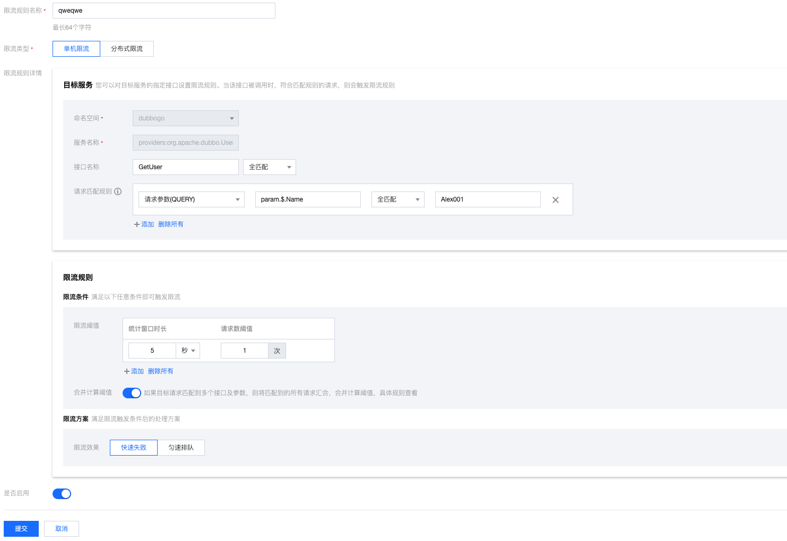

# Dubbo Go & Polaris TpsLimiter Example

English | [中文](./README-zh.md)

## Use the service current limit function

Quickly experience Polaris' service current limiting capabilities in dubbogo

## Polaris server installation

[Polaris Server Standalone Version Installation Documentation](https://polarismesh.cn/docs/%E4%BD%BF%E7%94%A8%E6%8C%87%E5%8D%97/%E6%9C%8D%E5%8A%A1%E7%AB%AF%E5%AE%89%E8%A3%85/%E5%8D%95%E6%9C%BA%E7%89%88%E5%AE%89%E8%A3%85/)

[Polaris Server Cluster Version Installation Documentation](https://polarismesh.cn/docs/%E4%BD%BF%E7%94%A8%E6%8C%87%E5%8D%97/%E6%9C%8D%E5%8A%A1%E7%AB%AF%E5%AE%89%E8%A3%85/%E9%9B%86%E7%BE%A4%E7%89%88%E5%AE%89%E8%A3%85/)

## how to use

[Polaris Service Current Limitation Documentation](https://polarismesh.cn/docs/%E5%8C%97%E6%9E%81%E6%98%9F%E6%98%AF%E4%BB%80%E4%B9%88/%E5%8A%9F%E8%83%BD%E7%89%B9%E6%80%A7/%E6%B5%81%E9%87%8F%E7%AE%A1%E7%90%86/#%E8%AE%BF%E9%97%AE%E9%99%90%E6%B5%81)

### dubbogo.yaml configuration file

When using PolarisMesh's service current limiting capability, you need to enable PolarisMesh's registration discovery function in dubbogo firstly.

````yaml
dubbo:
  registries:
    polarisMesh:
      protocol: polaris
      address: ${Polaris server IP}:8091
      namespace: ${Polaris namespace information}
      token: ${Polaris resource authentication token} # If the Polaris server has enabled authentication for the client, you need to configure this parameter
  provider:
    services:
      UserProvider:
        interface: org.apache.dubbo.UserProvider.Test
        tps.limiter: polaris-limit # Configure tps.limiter as polaris-limiter

````

Note: The service current limiting capability of PolarisMesh works on the Provider side.

### How to configure service current limit parameters

The implementation of the PolarisMesh TpsLimiter extension point in dubbogo can automatically identify the request tag information that needs to participate in current limiting from the current RPC call context and request information according to the current limiting rules configured by the user.



- The request matching rule is **Request parameter(QUERY)**
  - Tag source: the input parameter of the method in the RPC call, namely Invoaction.Arguments()
  - Tag key rules
    - The method has only one input parameter: param.$.${fieldName}, **param.** is a fixed prefix, the following expressions are standard JSONPath expressions, [reference document](https://goessner.net/ articles/JsonPath/)
    - The method has multiple parameters: param[${index}].$.${fieldName}, **param[${index}].** is a fixed prefix, ${index} represents the first parameter in the method parameter Several parameters, the starting position of the subscript starts from 0; the following expressions are standard JSONPath expressions, [reference document](https://goessner.net/articles/JsonPath/)
- The request matching rule is **request header (HEADER)**:
  - Tag source: Additional tag information for RPC calls, i.e. Invoaction.Attachments()

### Running the service provider

Enter the cmd directory of go-server and execute the following command

````
 export DUBBO_GO_CONFIG_PATH="../conf/dubbogo.yml"
 go run .
````

When you see the following log, it means that the server side started successfully

````log
INFO dubbo/dubbo_protocol.go:84 [DUBBO Protocol] Export service:
````


### Run the service caller

Enter the cmd directory of go-client and execute the following command


````
 export DUBBO_GO_CONFIG_PATH="../conf/dubbogo.yml"
 go run .
````

When you see the following log, it means that go-client successfully discovered go-server and made an RPC call

````log
INFO cmd/main.go:75 response: &{A001 Alex Stocks 18 2022-11-19 12:52:38.092 +0800 CST}
````

When you see the following log, it means that the current limiting policy configured for go-server in PolarisMesh has taken effect

````log
ERROR handler/rejected_execution_handler_only_log.go:73 The invocation was rejected
````