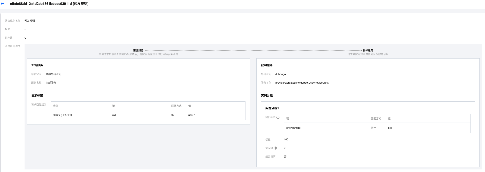

# Dubbo Go & Polaris Router Example

[English](./README.md) | 中文

## 使用服务路由功能

在 dubbogo 中快速体验北极星的服务路由能力

## 北极星服务端安装

[北极星服务端单机版本安装文档](https://polarismesh.cn/docs/%E4%BD%BF%E7%94%A8%E6%8C%87%E5%8D%97/%E6%9C%8D%E5%8A%A1%E7%AB%AF%E5%AE%89%E8%A3%85/%E5%8D%95%E6%9C%BA%E7%89%88%E5%AE%89%E8%A3%85/)

[北极星服务端集群版本安装文档](https://polarismesh.cn/docs/%E4%BD%BF%E7%94%A8%E6%8C%87%E5%8D%97/%E6%9C%8D%E5%8A%A1%E7%AB%AF%E5%AE%89%E8%A3%85/%E9%9B%86%E7%BE%A4%E7%89%88%E5%AE%89%E8%A3%85/)

## 如何使用

[北极星服务路由使用文档](https://polarismesh.cn/docs/%E5%8C%97%E6%9E%81%E6%98%9F%E6%98%AF%E4%BB%80%E4%B9%88/%E5%8A%9F%E8%83%BD%E7%89%B9%E6%80%A7/%E6%B5%81%E9%87%8F%E7%AE%A1%E7%90%86/#%E5%8A%A8%E6%80%81%E8%B7%AF%E7%94%B1)

### dubbogo.yaml 配置文件

在使用 PolarisMesh 的服务路由能力时，需要先启用 PolarisMesh 在 dubbogo 中的注册发现功能。

```yaml
dubbo:
  registries:
    polarisMesh:
      protocol: polaris
      address: ${北极星服务端IP}:8091
      namespace: ${北极星命名空间信息}
      token: ${北极星资源鉴权 token}   # 如果北极星服务端开启了针对客户端的鉴权，则需要配置该参数
  provider:
    services:
      UserProvider:
        interface: org.apache.dubbo.UserProvider.Test
```

### 如何配置服务路由参数

dubbogo 中的 PolarisMesh PriorityRouter 扩展点实现，能够根据用户配置的服务路由规则，自动的从当前 RPC 调用上下文以及请求信息中识别出需要参与服务路由的请求标签信息





- 请求匹配规则为 **请求参数(QUERY)**
  - 标签来源: RPC 调用中方法的入参，即 Invoaction.Arguments()
  - 标签键规则
    - 方法仅有一个入参: param.$.${fieldName}, **param.** 为固定前缀，后面的表达式为标准的 JSONPath expressions，[参考文档](https://goessner.net/articles/JsonPath/)
    - 方法有多个参数: param[${index}].$.${fieldName}, **param[${index}].** 为固定前缀，${index} 代表是方法入参中的第几个参数，下标起始位置从 0 开始；后面的表达式为标准的 JSONPath expressions，[参考文档](https://goessner.net/articles/JsonPath/)
- 请求匹配规则为 **请求头(HEADER)**: 
  - 标签来源: RPC 调用的额外标签信息，即 Invoaction.Attachments()

### 运行服务提供者

分别进入 server-prod、server-pre、server-dev 的 cmd 目录，执行以下命令

```
 export DUBBO_GO_CONFIG_PATH="../conf/dubbogo.yaml"
 go run .
```

当看到以下日志时即表示 server 端启动成功

```log
INFO    dubbo/dubbo_protocol.go:84      [DUBBO Protocol] Export service: 
```


### 运行服务调用者

进入 go-client 的 cmd 目录，执行以下命令


```
export DUBBO_GO_CONFIG_PATH="../conf/dubbogo.yml"
export uid=user-1
go run .
```

当看到以下日志时即表示 go-client 成功发现 go-server 并发起了 RPC 调用

```log
INFO    cmd/main.go:75  response: &{A001 Alex Stocks 18 2022-11-19 12:52:38.092 +0800 CST}
```

分别执行以下命令

```bash
export uid=
go run .

export uid=user-1
go run .

export uid=user-2
```

当看到以下日志时即表示在 PolarisMesh 配置的路由策略已生效

```log
# export uid=
2022-11-26T13:39:31.637+0800    INFO    cmd/main.go:78  response: &{A001 [Prod] Alex Stocks 18 2022-11-26 13:39:31.637 +0800 CST}
2022-11-26T13:39:31.842+0800    INFO    cmd/main.go:78  response: &{A001 [Prod] Alex Stocks 18 2022-11-26 13:39:31.841 +0800 CST}
2022-11-26T13:39:32.043+0800    INFO    cmd/main.go:78  response: &{A001 [Prod] Alex Stocks 18 2022-11-26 13:39:32.043 +0800 CST}
2022-11-26T13:39:32.247+0800    INFO    cmd/main.go:78  response: &{A001 [Prod] Alex Stocks 18 2022-11-26 13:39:32.247 +0800 CST}
2022-11-26T13:39:32.452+0800    INFO    cmd/main.go:78  response: &{A001 [Prod] Alex Stocks 18 2022-11-26 13:39:32.452 +0800 CST}

# export uid=user-1
2022-11-26T13:39:51.053+0800    INFO    cmd/main.go:78  response: &{A001 [Pre] Alex Stocks 18 2022-11-26 13:39:51.053 +0800 CST}
2022-11-26T13:39:51.257+0800    INFO    cmd/main.go:78  response: &{A001 [Pre] Alex Stocks 18 2022-11-26 13:39:51.257 +0800 CST}
2022-11-26T13:39:51.459+0800    INFO    cmd/main.go:78  response: &{A001 [Pre] Alex Stocks 18 2022-11-26 13:39:51.459 +0800 CST}
2022-11-26T13:39:51.662+0800    INFO    cmd/main.go:78  response: &{A001 [Pre] Alex Stocks 18 2022-11-26 13:39:51.662 +0800 CST}
2022-11-26T13:39:51.866+0800    INFO    cmd/main.go:78  response: &{A001 [Pre] Alex Stocks 18 2022-11-26 13:39:51.866 +0800 CST}

# export uid=user-2
2022-11-26T13:42:39.351+0800    INFO    cmd/main.go:78  response: &{A001 [Dev] Alex Stocks 18 2022-11-26 13:42:39.351 +0800 CST}
2022-11-26T13:42:39.555+0800    INFO    cmd/main.go:78  response: &{A001 [Dev] Alex Stocks 18 2022-11-26 13:42:39.555 +0800 CST}
2022-11-26T13:42:39.760+0800    INFO    cmd/main.go:78  response: &{A001 [Dev] Alex Stocks 18 2022-11-26 13:42:39.76 +0800 CST}
2022-11-26T13:42:39.962+0800    INFO    cmd/main.go:78  response: &{A001 [Dev] Alex Stocks 18 2022-11-26 13:42:39.961 +0800 CST}
2022-11-26T13:42:40.165+0800    INFO    cmd/main.go:78  response: &{A001 [Dev] Alex Stocks 18 2022-11-26 13:42:40.165 +0800 CST}
```
