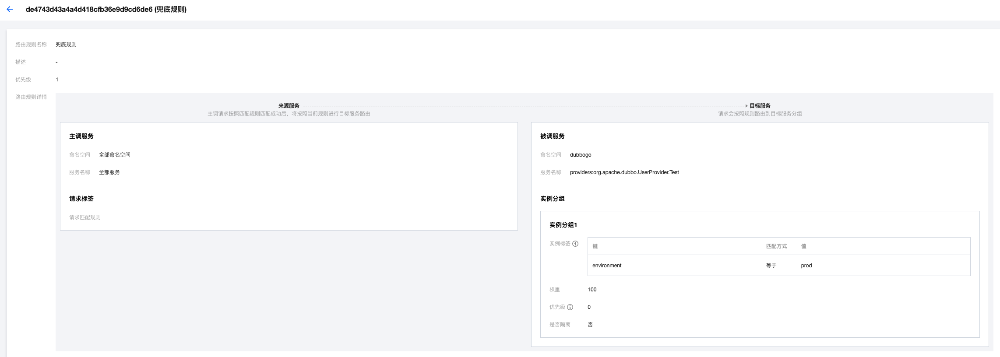
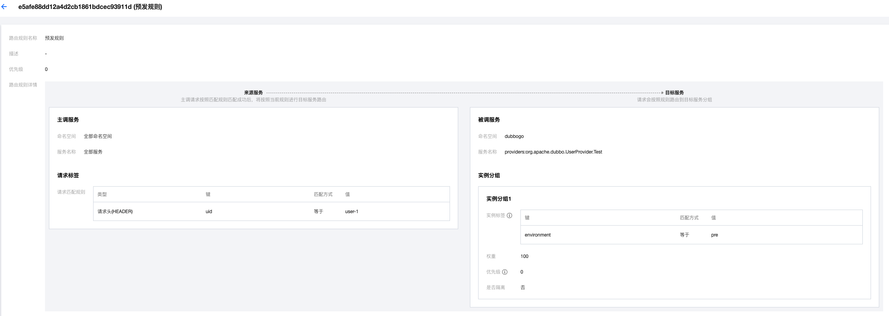
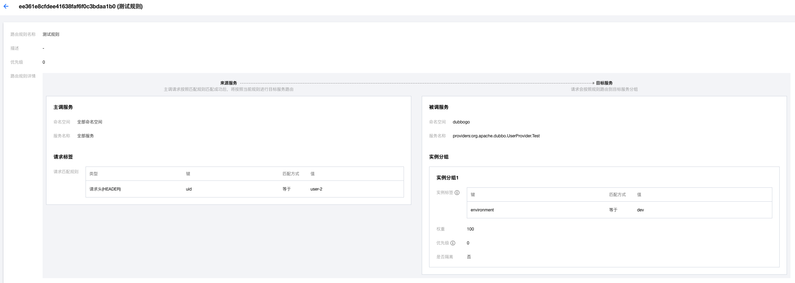

# Dubbo Go & Polaris Router Example

English | [中文](./README-zh.md)

## Using the service routing function

Quickly experience Polaris' service routing capabilities in dubbogo

## Polaris server installation

[Polaris Server Standalone Version Installation Documentation](https://polarismesh.cn/docs/%E4%BD%BF%E7%94%A8%E6%8C%87%E5%8D%97/%E6%9C%8D%E5%8A%A1%E7%AB%AF%E5%AE%89%E8%A3%85/%E5%8D%95%E6%9C%BA%E7%89%88%E5%AE%89%E8%A3%85/)

[Polaris Server Cluster Version Installation Documentation](https://polarismesh.cn/docs/%E4%BD%BF%E7%94%A8%E6%8C%87%E5%8D%97/%E6%9C%8D%E5%8A%A1%E7%AB%AF%E5%AE%89%E8%A3%85/%E9%9B%86%E7%BE%A4%E7%89%88%E5%AE%89%E8%A3%85/)

## how to use

[Polaris Service Routing Usage Document](https://polarismesh.cn/docs/%E5%8C%97%E6%9E%81%E6%98%9F%E6%98%AF%E4%BB%80%E4%B9%88/%E5%8A%9F%E8%83%BD%E7%89%B9%E6%80%A7/%E6%B5%81%E9%87%8F%E7%AE%A1%E7%90%86/#%E5%8A%A8%E6%80%81%E8%B7%AF%E7%94%B1)

### dubbogo.yaml configuration file

When using PolarisMesh's service route capability, you need to enable PolarisMesh's registration discovery function in dubbogo first.

````yaml
dubbo:
  registries:
    polarisMesh:
      protocol: polaris
      address: ${Polaris server IP}:8091
      namespace: ${Polaris namespace information}
      token: ${Polaris resource authentication token} # If the Polaris server has enabled authentication for the client, you need to configure this parameter
  provider:
    services:
      UserProvider:
        interface: org.apache.dubbo.UserProvider.Test
````

### How to configure service routing parameters

The implementation of the PolarisMesh PriorityRouter extension point in dubbogo can automatically identify the request label information that needs to participate in service routing from the current RPC call context and request information according to the service route rules configured by the user.





- The request matching rule is **Request parameter(QUERY)**
  - Tag source: the input parameter of the method in the RPC call, namely Invoaction.Arguments()
  - Tag key rules
    - The method has only one input parameter: param.$.${fieldName}, **param.** is a fixed prefix, the following expressions are standard JSONPath expressions, [reference document](https://goessner.net/ articles/JsonPath/)
    - The method has multiple parameters: param[${index}].$.${fieldName}, **param[${index}].** is a fixed prefix, ${index} represents the first parameter in the method parameter Several parameters, the starting position of the subscript starts from 0; the following expressions are standard JSONPath expressions, [reference document](https://goessner.net/articles/JsonPath/)
- The request matching rule is **request header (HEADER)**:
  - Tag source: Additional tag information for RPC calls, i.e. Invoaction.Attachments()

### Running the service provider

Enter the cmd directory of server-prod, server-pre, and server-dev respectively, and execute the following commands

````
 export DUBBO_GO_CONFIG_PATH="../conf/dubbogo.yaml"
 go run .
````

When you see the following log, it means that the server side started successfully

````log
INFO dubbo/dubbo_protocol.go:84 [DUBBO Protocol] Export service:
````


### Running the service caller

Enter the cmd directory of go-client and execute the following command


````
export DUBBO_GO_CONFIG_PATH="../conf/dubbogo.yml"
export uid=user-1
go run .
````

When you see the following log, it means that go-client successfully discovered go-server and made an RPC call

````log
INFO cmd/main.go:75 response: &{A001 Alex Stocks 18 2022-11-19 12:52:38.092 +0800 CST}
````

Execute the following commands respectively

```bash
export uid=
go run .

export uid=user-1
go run .

export uid=user-2
````

When you see the following log, it means that the routing policy configured in PolarisMesh has taken effect

```log
# export uid=
2022-11-26T13:39:31.637+0800    INFO    cmd/main.go:78  response: &{A001 [Prod] Alex Stocks 18 2022-11-26 13:39:31.637 +0800 CST}
2022-11-26T13:39:31.842+0800    INFO    cmd/main.go:78  response: &{A001 [Prod] Alex Stocks 18 2022-11-26 13:39:31.841 +0800 CST}
2022-11-26T13:39:32.043+0800    INFO    cmd/main.go:78  response: &{A001 [Prod] Alex Stocks 18 2022-11-26 13:39:32.043 +0800 CST}
2022-11-26T13:39:32.247+0800    INFO    cmd/main.go:78  response: &{A001 [Prod] Alex Stocks 18 2022-11-26 13:39:32.247 +0800 CST}
2022-11-26T13:39:32.452+0800    INFO    cmd/main.go:78  response: &{A001 [Prod] Alex Stocks 18 2022-11-26 13:39:32.452 +0800 CST}

# export uid=user-1
2022-11-26T13:39:51.053+0800    INFO    cmd/main.go:78  response: &{A001 [Pre] Alex Stocks 18 2022-11-26 13:39:51.053 +0800 CST}
2022-11-26T13:39:51.257+0800    INFO    cmd/main.go:78  response: &{A001 [Pre] Alex Stocks 18 2022-11-26 13:39:51.257 +0800 CST}
2022-11-26T13:39:51.459+0800    INFO    cmd/main.go:78  response: &{A001 [Pre] Alex Stocks 18 2022-11-26 13:39:51.459 +0800 CST}
2022-11-26T13:39:51.662+0800    INFO    cmd/main.go:78  response: &{A001 [Pre] Alex Stocks 18 2022-11-26 13:39:51.662 +0800 CST}
2022-11-26T13:39:51.866+0800    INFO    cmd/main.go:78  response: &{A001 [Pre] Alex Stocks 18 2022-11-26 13:39:51.866 +0800 CST}

# export uid=user-2
2022-11-26T13:42:39.351+0800    INFO    cmd/main.go:78  response: &{A001 [Dev] Alex Stocks 18 2022-11-26 13:42:39.351 +0800 CST}
2022-11-26T13:42:39.555+0800    INFO    cmd/main.go:78  response: &{A001 [Dev] Alex Stocks 18 2022-11-26 13:42:39.555 +0800 CST}
2022-11-26T13:42:39.760+0800    INFO    cmd/main.go:78  response: &{A001 [Dev] Alex Stocks 18 2022-11-26 13:42:39.76 +0800 CST}
2022-11-26T13:42:39.962+0800    INFO    cmd/main.go:78  response: &{A001 [Dev] Alex Stocks 18 2022-11-26 13:42:39.961 +0800 CST}
2022-11-26T13:42:40.165+0800    INFO    cmd/main.go:78  response: &{A001 [Dev] Alex Stocks 18 2022-11-26 13:42:40.165 +0800 CST}
```
