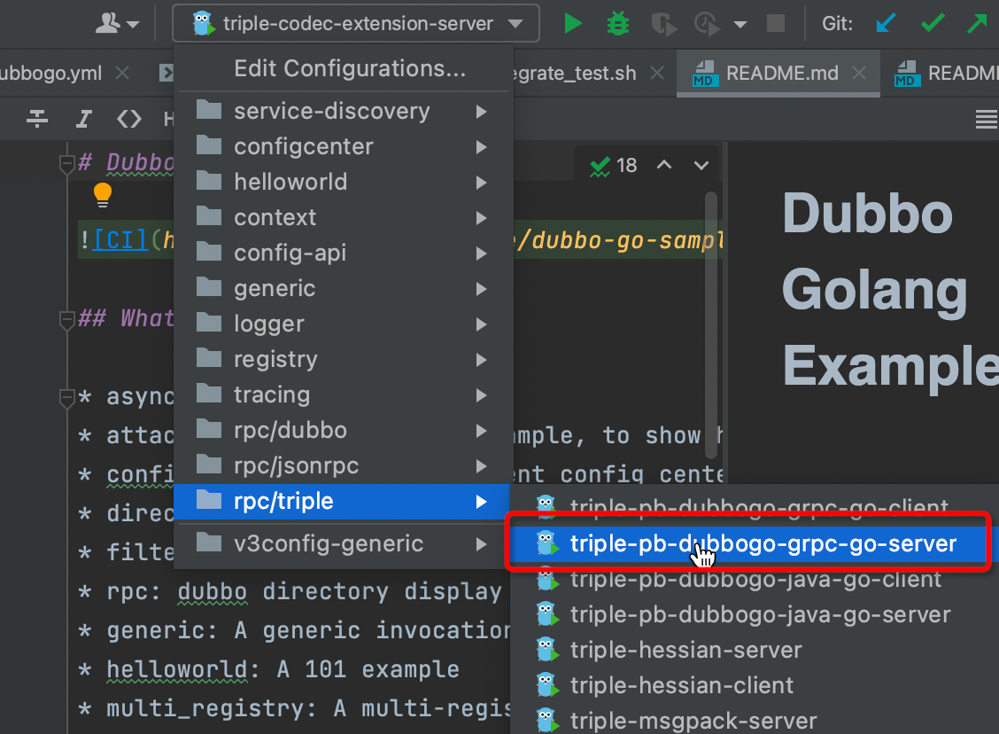
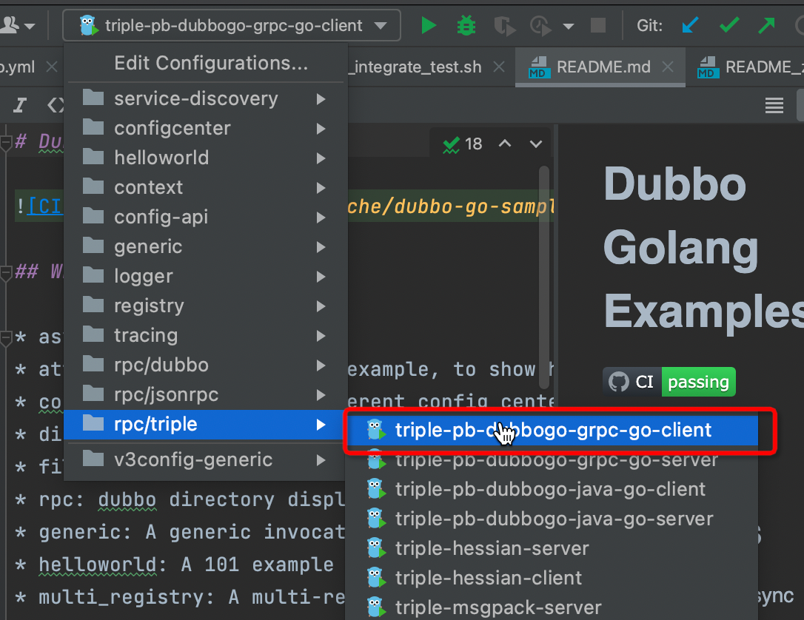

# Triple Samples

Triple is  dubbo3.0 network protocol. You can refer to [dubbogo/triple](https://github.com/dubbogo/triple) repo for more information. Triple is extended from old Dubbogo framework, it supports pb serilization, and can interact with dubbo-java 3.0 and  gRPC. It also support unary RPC and streaming RPC invocation. Triple is main protocol that  Dubbo echology recommends.

## Samples content

- [codec-extension](./codec-extension): user defined serialization sample
- [hessian2](./hessian2): Hessian2 serialization sample
- [msgpack](./msgpack): Msgpack serialization sample
- [pb](./pb):  ProtoBuf(PB) serialization sample
  - [dubbogo-grpc](./pb/dubbogo-grpc): Triple and gRPC interactive samples
  - [dubbogo-java](./pb/dubbogo-java): Triple-java and Triple-go interactive samples

## How to write configuration file

- Server

```yaml
dubbo:
  protocols: # dubbogo framework network protocol configuration
    myProtocol: # user defined protocol Key
      name: tri # protocol name, suppporting: tri/dubbo/grpc/jsonrpc
      port: 20000 # port to export service

  provider: 
    services: 
      MyProvider: # service provider type name 
        interface: org.apache.dubbogo.MyProvider # user defined interface name
      # serialization: hessian2 # serialization that can be choosed：pb/hessian2/custome
      # pb serialization by default
```

- Client

```yml
dubbo:
consumer:
  references:
    ClientImpl: # client struct type name
      protocol: tri # protocol name，supporting: tri/dubbo/grpc/jsonrpc，compatiable with server
      interface: org.apache.dubbo.demo.Greeter # user defined interface name
    # serialization: hessian2 # serialization that can be choosed：pb/hessian2/custome
    # pb serialization by default
```

## How to run

We choose pb/dubbogo-grpc as an example, which is dubbogo-client invokes dubbogo-server using triple protocol and pb seriazliation.

Start zk server, listening on 127.0.0.1:2181. If you have installed docker locally, you can choose to exec following commands to start all componnets that dubbogo relies on: zk(2181), nacos(8848), etcd(2379).

`docker-compose -f {PATH_TO_SAMPLES_PROJECT}/integrate_test/dockercompose/docker-compose.yml up -d`

### Run with Goland



You can start client after server started.




### Run with terminal

- Server

`cd rpc/triple/pb/dubbogo-grpc/go-server/cmd` # go to server samples

`export DUBBO_GO_CONFIG_PATH="../conf/dubbogo.yml`# set env of dubbogo config

`go run .` # start server

- Server

`cd rpc/triple/pb/dubbogo-grpc/go-server/cmd` # go to client samples

`export DUBBO_GO_CONFIG_PATH="../conf/dubbogo.yml` # set env of dubbogo config

`go run .` # start client


### Success flag

After you starting with one of above, you can see following info log if success.

`INFO    cmd/client.go:108       Receive user = name:"Hello laurence" id:"12345" age:21`
